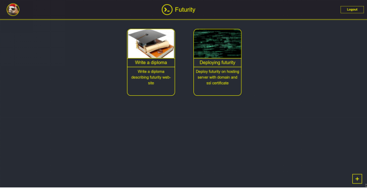

# Futurity
### Features
- Registration with sending an email;
- Authorization;
- The ability to create projects;
- Implementation of kanban board;
- The ability to set a deadline; 
- The ability to track time.
### Architecture

### Security

### Web App

